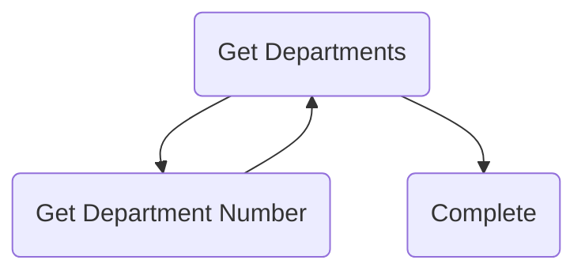

# Member.

::: tip Use Component
`el-tree`
:::

## Clients

1. Class (Registerable)
2. Member Admin (Minister) (Addable, Deletable, Position Editable)
3. Member Admin (Core ex minister, vice minister) (ONLY Viewable)
   1. Vice Minister, ONLY the department you in.
   2. Core, ALL departments.
4. Admin (Addable, Editable(Position, Department, etc.), Deletable).

## Declarations

```typescript
// Tree options declaration
declare interface options {
  label: string // The label which can print in the DOM.
  value: string // number (id), NUMBER
  children: options[]
}

declare type member_list = options[]
```

## APIs

```jsonc
{
  "class": {
    "view": {
      "url": "/api/class/:gradeid/:classid/member",
      "method": "get",
      "req": null,
      "res": {
        "status": "ok",
        "details": options
      }
    },
    "register": {
      "url": "/api/class/:gradeid/:classid/member",
      "method": "post",
      "req": member,
      "res": {
        "status": "ok"
      }
    }
  },
  "member": {
    "view": {
      "url": "/api/member/member",
      "method": "get",
      "req": {
        "number": number
      },
      "res": {
        "status": "ok",
        "details": options
      }
    }, // filter at the code
    "delete": {
      "url": "/api/member/member",
      "method": "delete",
      "req": {
        "number": number, // actioner
        "id": number // deleted
      },
      "res": {
        "status": "ok"
      }
    },
    "add": {
      "url": "/api/member/member",
      "method": "post",
      "req": {
        "number": number, // actioner
        "details": member
      },
      "res": {
        "status": "ok"
      }
    },
    "edit": {
      "url": "/api/member/member",
      "method": "patch",
      "req": {
        "number": number, // actioner
        "details": patch_rule
      },
      "res": {
        "status": "ok"
      }
    },
  },
  "admin": {
    "view": {
      "url": "/api/admin/member",
      "method": "get",
      "req": null,
      "res": {
        "status": "ok",
        "details": options
      }
    }, // filter at the code
    "delete": {
      "url": "/api/admin/member",
      "method": "delete",
      "req": {
        "id": number // deleted
      },
      "res": {
        "status": "ok"
      }
    },
    "add": {
      "url": "/api/admin/member",
      "method": "post",
      "req": {
        "details": member
      },
      "res": {
        "status": "ok"
      }
    },
    "edit": {
      "url": "/api/admin/member",
      "method": "patch",
      "req": {
        "details": patch_rule
      },
      "res": {
        "status": "ok"
      }
    },
  }
}
```

### Patch Rules

```typescript
declare interface patch_department {
  number: number
  type: 'department'
  current: string // department
}

declare interface patch_position {
  number: number
  type: 'position'
  current: 'none' | 'register' | 'clerk' | 'vice-minister' | 'minister' | 'vice-chairman' | 'chairman'
}

declare type patch_rule = patch_department | patch_position
```

### Filters

### All Member



---

## Realize Map

- [x] Use `tree` instead of `table`.
- [x] Use the `RESTful` api.
- [ ] Fixes for `Member Admin` and `Class`
- [x] Use `dialog` in order to "bounce" the details.
- [ ] Quickly choose the person in order that the user can send the message to him/her directly.
